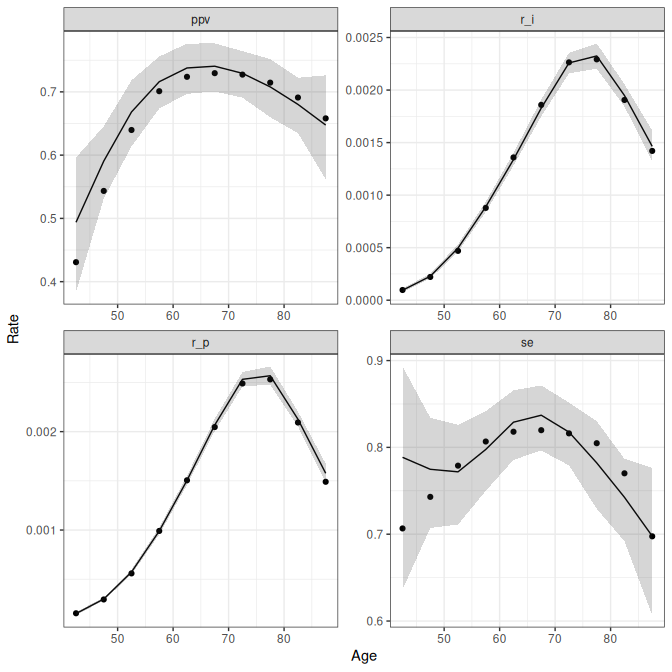
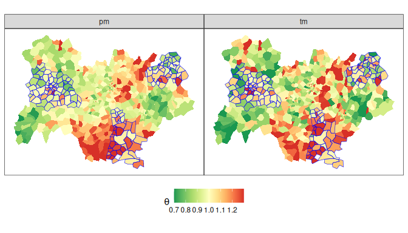

This document illustrates how to estimate BP-SP models on a restricted
simulated dataset using `R` version 4.5.3 and `cmdstan` version 2.38.0.

The session info is the following:


``` r
sessionInfo()
#> R version 4.5.3 (2026-03-11)
#> Platform: x86_64-pc-linux-gnu
#> Running under: Ubuntu 24.04.4 LTS
#> 
#> Matrix products: default
#> BLAS:   /usr/lib/x86_64-linux-gnu/openblas-pthread/libblas.so.3 
#> LAPACK: /usr/lib/x86_64-linux-gnu/openblas-pthread/libopenblasp-r0.3.26.so;  LAPACK version 3.12.0
#> 
#> locale:
#>  [1] LC_CTYPE=en_US.UTF-8       LC_NUMERIC=C              
#>  [3] LC_TIME=en_US.UTF-8        LC_COLLATE=en_US.UTF-8    
#>  [5] LC_MONETARY=en_US.UTF-8    LC_MESSAGES=en_US.UTF-8   
#>  [7] LC_PAPER=en_US.UTF-8       LC_NAME=C                 
#>  [9] LC_ADDRESS=C               LC_TELEPHONE=C            
#> [11] LC_MEASUREMENT=en_US.UTF-8 LC_IDENTIFICATION=C       
#> 
#> time zone: Etc/UTC
#> tzcode source: system (glibc)
#> 
#> attached base packages:
#> [1] stats     graphics  grDevices utils     datasets  methods   base     
#> 
#> loaded via a namespace (and not attached):
#>  [1] digest_0.6.39     R6_2.6.1          fastmap_1.2.0     xfun_0.57        
#>  [5] cachem_1.1.0      knitr_1.51        htmltools_0.5.9   rmarkdown_2.31   
#>  [9] lifecycle_1.0.5   cli_3.6.6         sass_0.4.10       jquerylib_0.1.4  
#> [13] compiler_4.5.3    rstudioapi_0.18.0 tools_4.5.3       evaluate_1.0.5   
#> [17] bslib_0.10.0      yaml_2.3.12       otel_0.2.0        jsonlite_2.0.0   
#> [21] rlang_1.2.0
print(cmdstanr::cmdstan_version())
#> [1] "2.38.0"
```


## Dataset Overview

The analysis is based on a simulated dataset `dt_sim`, which consists
of gold-standard incidence $I$ observed in 183 postal codes
supposedly covered by cancer registries, and proxy counts $P$
observed in all of the 704 postal codes in the territory. The shape of
the analysed region is contained in the dataset `shap_geo`.  

The shape of the incidence rate, and the $se$ and $ppv$ values by age,
are taken from the estimates for Corpus Uteri cancer in women (CU)
with the hospitalisation proxy. The parameters used for the simulation
are the same as those used in the simulation section of the manuscript
for the $\rho=0.7$ and $N=20$ scenario. They are given in the
following table: 


```
#> ── Attaching core tidyverse packages ──────────────────────── tidyverse 2.0.0 ──
#> ✔ dplyr     1.2.1     ✔ readr     2.2.0
#> ✔ forcats   1.0.1     ✔ stringr   1.6.0
#> ✔ ggplot2   4.0.3     ✔ tibble    3.3.1
#> ✔ lubridate 1.9.5     ✔ tidyr     1.3.2
#> ✔ purrr     1.2.2     
#> ── Conflicts ────────────────────────────────────────── tidyverse_conflicts() ──
#> ✖ dplyr::filter()     masks stats::filter()
#> ✖ dplyr::group_rows() masks kableExtra::group_rows()
#> ✖ dplyr::lag()        masks stats::lag()
#> ℹ Use the conflicted package (<http://conflicted.r-lib.org/>) to force all conflicts to become errors
```

<table class="table table-striped table-hover" style="color: black; margin-left: auto; margin-right: auto;">
 <thead>
  <tr>
   <th style="text-align:left;"> param </th>
   <th style="text-align:right;"> value </th>
  </tr>
 </thead>
<tbody>
  <tr>
   <td style="text-align:left;"> $N$ </td>
   <td style="text-align:right;"> 20.00 </td>
  </tr>
  <tr>
   <td style="text-align:left;"> $\overline{Se}$ </td>
   <td style="text-align:right;"> 0.80 </td>
  </tr>
  <tr>
   <td style="text-align:left;"> $\overline{PPV}$ </td>
   <td style="text-align:right;"> 0.70 </td>
  </tr>
  <tr>
   <td style="text-align:left;"> $\sigma_c$ </td>
   <td style="text-align:right;"> 0.20 </td>
  </tr>
  <tr>
   <td style="text-align:left;"> $\phi_c$ </td>
   <td style="text-align:right;"> 0.70 </td>
  </tr>
  <tr>
   <td style="text-align:left;"> $\delta_1$ </td>
   <td style="text-align:right;"> 0.57 </td>
  </tr>
  <tr>
   <td style="text-align:left;"> $\phi_1$ </td>
   <td style="text-align:right;"> 0.70 </td>
  </tr>
  <tr>
   <td style="text-align:left;"> $\delta_2$ </td>
   <td style="text-align:right;"> 0.41 </td>
  </tr>
  <tr>
   <td style="text-align:left;"> $\phi_2$ </td>
   <td style="text-align:right;"> 0.70 </td>
  </tr>
  <tr>
   <td style="text-align:left;"> $\rho$ </td>
   <td style="text-align:right;"> 0.70 </td>
  </tr>
</tbody>
</table>


## Setup
The code used for the simulations is detailed in the vignette [simulate-data](simulate-data.md).

We first load the packages required for data manipulation, the
dataset, and some utility functions needed to format the datasets for
`stan` use: 


``` r
library(tidyverse)
theme_set(theme_bw())
library(magrittr)
#> 
#> Attaching package: 'magrittr'
#> The following object is masked from 'package:purrr':
#> 
#>     set_names
#> The following object is masked from 'package:tidyr':
#> 
#>     extract
library(Matrix)
#> 
#> Attaching package: 'Matrix'
#> The following objects are masked from 'package:tidyr':
#> 
#>     expand, pack, unpack
library(mgcv)
#> Loading required package: nlme
#> 
#> Attaching package: 'nlme'
#> The following object is masked from 'package:dplyr':
#> 
#>     collapse
#> This is mgcv 1.9-4. For overview type '?mgcv'.
library(sf)
#> Linking to GEOS 3.12.1, GDAL 3.8.4, PROJ 9.4.0; sf_use_s2() is TRUE
library(spdep)
#> Loading required package: spData
#> To access larger datasets in this package, install the spDataLarge
#> package with: `install.packages('spDataLarge',
#> repos='https://nowosad.github.io/drat/', type='source')`
library(RSpectra)
library(here)
#> here() starts at /home/onyxia/work/bpsp

load(here("data/shap_geo.rda")) ## Shapefile
load(here("data/dt_sim.rda")) ## Simulated data
source(here("R/format_data.R")) ## R utilities to format data

```


Estimation of the model may be done with `stan` or `cmdstan`. We use
the latter in this vignette (see https://mc-stan.org/cmdstanr/ for
installation instructions), and we will use the `tidybayes` package
to format posterior estimates. 


``` r
library(cmdstanr)
#> This is cmdstanr version 0.9.0
#> - CmdStanR documentation and vignettes: mc-stan.org/cmdstanr
#> - CmdStan path: /home/onyxia/.cmdstan/cmdstan-2.38.0
#> - CmdStan version: 2.38.0
library(tidybayes)
```

The first step is to compile the `stan` program implementing the BP-SP
model. This is done as follows: 


``` r
bpsp <- cmdstan_model(here("inst/stan/bp_sp.stan"))

```

Next, the data must be processed to comply with the `stan` program
requirements. We built a dedicated function `prep_data` which
facilitates the data processing. 

The function has two data requirements:

1. `dt`: This must contain a `geo` column that identifies the
   geographical area, as well as the incidence and proxy counts, and
   any other covariate to be passed to the model. 
2. `geo`: This informs the geographical structure of the
   territory. The easiest format to use is an `sf` data.frame. 

And two formulas:

1. `form_id`: This specifies the within-area model. 
2. `form_geo`: This specifies the model for the spatial latent
   variables for incidence, $Se$, and $PPV$. Different specifications
   may be set for random effects (RE). For example, for an ICAR RE for
   $Se$, an IID for $PPV$, and BYM2 for incidence, the formula would
   be set as: 

   ```r
   form_geo = ~ i(bym(geo)) + se(icar(geo)) + ppv(iid(geo))
   ```


Here, we specify BYM2 prior for incidence, Se and PPV, and model age
via a cubic regression spline whith 5 knots, and put the log of
person-years as an offset for the component $\mu^I_{ij}$.


``` r
stan_dt <- prep_data(dt = dt_sim,
                     form_id = c(I,P) ~ offset(log(py)) + s(age,bs="cr",k=5,fx=TRUE),
                     form_geo= ~ bym(geo),
                     geo=shap_geo)

```

The `stan_dt`object is a tibble with four components:

1. `stan_dt$dt_fit`: a list of data for the stan fit;
3. `stan_dt$dt_post`: a tibble used in post-processing stan fit;
4. `stan_dt$form_id`: recall of `form_id`
5. `stan_dt$form_geo`: recall of `form_geo`

## Stan fit

Now that the material is set, we can sample the HMC:


``` r
chains=4
iter=1000
warmup=1000
thin=1

fit <- bpsp$sample(stan_dt$dt_fit[[1]],
                   chains = chains, parallel_chains = chains,
                   iter_sampling = iter,iter_warmup = warmup,thin = thin,
                   seed = 1,
                   adapt_delta = 0.95,
                   show_exceptions = TRUE,
                   refresh = round(iter/10),
                   save_warmup =F)

```

The model took 10 minutes to run on a CentOS 7 Linux server with an
Intel(R) Xeon(R) Gold 2.90 GHz processor. The fit is made available in the
file [`fit.rda`](https://drive.google.com/file/d/1BQ39CyDaCrRTwoK_pDNTBecakQTvlsaf/view?usp=sharing).


``` r
download.file(
  url="https://dataviz.santepubliquefrance.fr/bpsp/fit.rda", 
  destfile = here("data","fit.rda"), overwrite = TRUE)
load(here("data/fit.rda"))
```

## Posterior processing

The correspondence between the age and geo indexes in the Stan fit and
the original values is stored in the `stan_dt$dt_post` data.  
In the following, we build functions to establish this correspondence. 

``` r
  # Functions for posterior summary
  decod_age <- . %>%
    left_join(
      stan_dt$dt_post[[1]]$decod[[1]]$age,
      by=c("id_age")) %>%
    select(-id_age)
  
  decod_geo <- . %>%
    left_join(
      stan_dt$dt_post[[1]]$decod[[1]]$geo_ra %>%
        mutate(n_geo=n()) %>%
        bind_rows(
          stan_dt$dt_post[[1]]$decod[[1]]$geo %>%
            mutate(n_geo=n())),
      by=c("id_geo","n_geo")) %>%
    select(-id_geo)
  
```
  

### Parameters
The correspondence between the model parameters and their `stan` names
is given in the table below: 

<table class="table table-striped table-hover" style="color: black; margin-left: auto; margin-right: auto;">
 <thead>
  <tr>
   <th style="text-align:left;"> param </th>
   <th style="text-align:left;"> stan </th>
  </tr>
 </thead>
<tbody>
  <tr>
   <td style="text-align:left;"> $\overline{Se}$ </td>
   <td style="text-align:left;"> b_sp[1] </td>
  </tr>
  <tr>
   <td style="text-align:left;"> $\overline{PPV}$ </td>
   <td style="text-align:left;"> b_sp[2] </td>
  </tr>
  <tr>
   <td style="text-align:left;"> $\sigma_c$ </td>
   <td style="text-align:left;"> s_c </td>
  </tr>
  <tr>
   <td style="text-align:left;"> $\phi_c$ </td>
   <td style="text-align:left;"> phi_c </td>
  </tr>
  <tr>
   <td style="text-align:left;"> $\delta_1$ </td>
   <td style="text-align:left;"> s_u[1] </td>
  </tr>
  <tr>
   <td style="text-align:left;"> $\phi_1$ </td>
   <td style="text-align:left;"> phi_u[1] </td>
  </tr>
  <tr>
   <td style="text-align:left;"> $\delta_2$ </td>
   <td style="text-align:left;"> s_u[2] </td>
  </tr>
  <tr>
   <td style="text-align:left;"> $\phi_2$ </td>
   <td style="text-align:left;"> phi_u[1] </td>
  </tr>
  <tr>
   <td style="text-align:left;"> $\rho$ </td>
   <td style="text-align:left;"> r_u[1] </td>
  </tr>
  <tr>
   <td style="text-align:left;"> $\sigma_{\nu_1}$ </td>
   <td style="text-align:left;"> s_nu[1] </td>
  </tr>
  <tr>
   <td style="text-align:left;"> $\sigma_{\nu_2}$ </td>
   <td style="text-align:left;"> s_nu[2] </td>
  </tr>
  <tr>
   <td style="text-align:left;"> $\kappa$ </td>
   <td style="text-align:left;"> kappa </td>
  </tr>
  <tr>
   <td style="text-align:left;"> $\psi$ </td>
   <td style="text-align:left;"> psi </td>
  </tr>
  <tr>
   <td style="text-align:left;"> $\sigma_e$ </td>
   <td style="text-align:left;"> s_e </td>
  </tr>
  <tr>
   <td style="text-align:left;"> $\sigma_{d^\star}$ </td>
   <td style="text-align:left;"> s_ds </td>
  </tr>
</tbody>
</table>


Their posterior summaries are recovered using:


``` r
  # Parameters
  par_sum <- fit %>% 
    gather_draws(s_c,s_u[comp],s_d,s_ds,s_e,kappa,psi,b_sp[comp],phi_c,phi_u[comp],r_u[comp],s_nu[comp]) %>% 
    tidybayes::summarise_draws("mean", "median","sd", "rhat","ess_bulk","ess_tail",
                               ~quantile(.x, probs = c(0.025, 0.975)))%>%
    rename(pm=mean,par=.variable,low=`2.5%`,up=`97.5%`) %>%
    ungroup() %>%
    select(-variable) %>%
    mutate(par=ifelse(is.na(comp),par,paste0(par,comp))) %>%
    select(-comp)
  
  par_sum
#> # A tibble: 16 × 9
#>    par        pm median     sd  rhat ess_bulk ess_tail    low    up
#>    <chr>   <dbl>  <dbl>  <dbl> <dbl>    <dbl>    <dbl>  <dbl> <dbl>
#>  1 b_sp1  0.798  0.799  0.0134  1.00    2476.    2714. 0.772  0.824
#>  2 b_sp2  0.707  0.707  0.0130  1.00    1927.    2785. 0.681  0.732
#>  3 kappa  0.856  0.865  0.0669  1.01     670.    1522. 0.704  0.958
#>  4 phi_c  0.711  0.708  0.121   1.03     143.     199. 0.480  0.940
#>  5 phi_u1 0.595  0.610  0.227   1.00     713.    1002. 0.141  0.970
#>  6 phi_u2 0.580  0.591  0.190   1.01     613.    1379. 0.186  0.912
#>  7 psi    1.02   1.01   0.128   1.00    1130.    2259. 0.801  1.30 
#>  8 r_u1   0.692  0.737  0.188   1.00     545.    1205. 0.228  0.942
#>  9 s_c    0.230  0.229  0.0293  1.00     540.    1414. 0.177  0.291
#> 10 s_d    0.248  0.247  0.0276  1.00     621.    1844. 0.198  0.305
#> 11 s_ds   0.251  0.250  0.0198  1.01     341.     625. 0.216  0.292
#> 12 s_e    0.0909 0.0905 0.0213  1.00     935.    2174. 0.0511 0.134
#> 13 s_nu1  0.124  0.121  0.0356  1.00     571.    1335. 0.0637 0.204
#> 14 s_nu2  0.115  0.114  0.0358  1.00     278.     288. 0.0451 0.188
#> 15 s_u1   0.546  0.542  0.131   1.00     576.    1373. 0.297  0.816
#> 16 s_u2   0.376  0.377  0.110   1.00     270.     260. 0.149  0.589
```

The convergence criteria `rhat` and `ess` are generally good for the
relatively small number of iterations used. The key parameters
$\overline{Se}$, $\overline{PPV}$, $\sigma_c$, $\delta_1$, $\delta_2$,
and $\rho$ are in line with the values used for the simulations.   

### Age rates
The median age rates ($r^I_i$, $r^P_i$, $Se_i$, and $PPV_i$) are
stored in the `rho` parameters, which are summarized as follows: 

``` r
  ## Age rates------
  ar_sum <- fit %>% gather_draws(rho[id_age,comp]) %>%
    group_by(id_age,comp) %>%
    select(-.variable) %>%
    tidybayes::summarise_draws("mean", "median","sd", "rhat","ess_bulk","ess_tail",
                               ~quantile(.x, probs = c(0.025, 0.975)))%>%
    rename(pm=mean,low=`2.5%`,up=`97.5%`) %>%
    ungroup() %>%
    mutate(comp=factor(comp,labels=c("r_i","r_p","se","ppv"))) %>%
    select(-contains("variable")) %>%
    decod_age() 
```

We can compare them with the true values used for the simulations,
showing the good agreement between the estimated rates and the true
rates used for the simulations:  


``` r
  ar_sum %<>%
    left_join(
      dt_sim %>%
        ungroup() %>%
        select(age,r_i=muI,r_p=muP,se,ppv) %>%
        pivot_longer(-age, names_to = "comp",values_to = "tm") %>%
        group_by(age,comp) %>%
        summarise(tm=median(tm))
    )
#> `summarise()` has regrouped the output.
#> Joining with `by = join_by(comp, age)`
#> ℹ Summaries were computed grouped by age and comp.
#> ℹ Output is grouped by age.
#> ℹ Use `summarise(.groups = "drop_last")` to silence this message.
#> ℹ Use `summarise(.by = c(age, comp))` for per-operation grouping
#>   (`?dplyr::dplyr_by`) instead.
  
  ar_sum %>%
    qplot( data=., age, tm)+
    geom_line(aes(age,pm))+
    geom_ribbon(aes(ymin=low,ymax=up),alpha=.2)+
    facet_wrap(~comp, scales="free")+
    xlab("Age")+ylab("Rate")
#> Warning: `qplot()` was deprecated in ggplot2 3.4.0.
#> This warning is displayed once per session.
#> Call `lifecycle::last_lifecycle_warnings()` to see where this warning was
#> generated.
```

<!-- -->
  
### Spatial risks
The spatial risks $\theta_j^I$ and $\theta_j^P$ are stored in the
`theta` parameters, whereas the risks $\nu_1$ and $\nu_2$ for $Se$ and
$PPV$ are given in the `nu` parameters. 


``` r
  # ## spatial risks------
  spr_sum <- fit %>%
    gather_draws(nu[id_geo,comp],theta[id_geo,comp]) %>%
    tidybayes::summarise_draws("mean", "median","sd", "rhat","ess_bulk","ess_tail",
                               ~quantile(.x, probs = c(0.025, 0.975)))%>%
    rename(pm=mean,low=`2.5%`,up=`97.5%`) %>%
    ungroup() %>%
    mutate(comp=ifelse(is.na(comp),.variable,paste0(.variable,"_",comp))) %>%
    select(-contains("variable"))
  
  spr_sum %<>%
    group_by(comp) %>%
    mutate(n_geo=length(unique(id_geo))) %>%
    decod_geo()

```

Again, in our simulation context, we can compare the estimates with
the true values:


``` r
  tm_spr<-
    dt_sim %>%
    select(age,geo,RA,py,theta_1=muI,theta_2=muP,nu_1=se,nu_2=ppv,u1,u2) %>%
    group_by(age) %>%
    mutate(across(c(theta_1,theta_2),median,.names = "E_{.col}"),
           across(c(nu_1,nu_2),median,.names = "E_{.col}"),
           w=sum(py)) %>%
    group_by(geo,RA) %>%
    summarise( 
      se_b=sum(w*E_theta_1*E_nu_1)/sum(w*E_theta_1),
      ppv_b=sum(w*E_theta_2*E_nu_2)/sum(w*E_theta_2),
      nu_1 = sum(w*E_theta_1*nu_1)/sum(w*E_theta_1)/se_b,
      nu_2 = sum(w*E_theta_2*nu_2)/sum(w*E_theta_2)/ppv_b,
      theta_1 = sum(py*theta_1)/sum(py*E_theta_1),
      theta_2 = sum(py*theta_2)/sum(py*E_theta_2)
    ) %>%
    ungroup() %>%
    pivot_longer(-c(geo,RA), names_to = "comp",values_to = "tm") 
#> `summarise()` has regrouped the output.
#> ℹ Summaries were computed grouped by geo and RA.
#> ℹ Output is grouped by geo.
#> ℹ Use `summarise(.groups = "drop_last")` to silence this message.
#> ℹ Use `summarise(.by = c(geo, RA))` for per-operation grouping
#>   (`?dplyr::dplyr_by`) instead.
  
  spr_sum %<>%
    left_join(  tm_spr,
                by=c("geo","comp","RA"))
  
  spr_sum %>%
    group_by(comp,RA)%>%
    summarise(., r = sqrt(mean((pm - tm)^2)), sp = sd(pm), st = sd(tm),     
              sm = mean(sd), c = cor(pm, tm), p = 100 * (1 - r^2/st^2),     
              IP = 100 * mean((tm > low) * (tm < up)), 
              across(c(pm, tm), mean))
#> `summarise()` has regrouped the output.
#> ℹ Summaries were computed grouped by comp and RA.
#> ℹ Output is grouped by comp.
#> ℹ Use `summarise(.groups = "drop_last")` to silence this message.
#> ℹ Use `summarise(.by = c(comp, RA))` for per-operation grouping
#>   (`?dplyr::dplyr_by`) instead.
#> # A tibble: 6 × 11
#> # Groups:   comp [4]
#>   comp    RA         r     sp    st     sm     c     p    IP    pm    tm
#>   <chr>   <lgl>  <dbl>  <dbl> <dbl>  <dbl> <dbl> <dbl> <dbl> <dbl> <dbl>
#> 1 nu_1    TRUE  0.0840 0.0618 0.104 0.0902 0.585  34.5  94.5 0.984 0.986
#> 2 nu_2    TRUE  0.0943 0.0546 0.116 0.0910 0.595  34.2  95.1 0.992 0.993
#> 3 theta_1 FALSE 0.159  0.168  0.217 0.164  0.688  46.4  96.4 1.02  1.01 
#> 4 theta_1 TRUE  0.143  0.177  0.204 0.158  0.731  51.2  97.3 1.05  1.06 
#> 5 theta_2 FALSE 0.161  0.198  0.241 0.159  0.748  55.4  96.2 1.02  1.03 
#> 6 theta_2 TRUE  0.160  0.184  0.231 0.166  0.742  51.8  96.2 1.04  1.08
```

The alignment between the posterior means and the true values is
consistent with the simulations results presented in the manuscript; notably, the
95% credible intervals show satisfactory coverage. 

Finally, we can map the estimated risks; for instance, the spatial
distribution of incidence (areas covered by a registry are highlighted
in blue):


``` r
shap_ra <- shap_geo %>%
  filter(geo %in% (dt_sim %>% filter(RA)%$%geo %>% unique()))

theme_map <-
  theme(panel.grid.major = element_blank(),
        panel.grid.minor = element_blank(),
        axis.text.x = element_blank(),
        axis.text.y = element_blank(),
        axis.ticks = element_blank(),
        panel.spacing = unit(0,'lines'))

spr_sum %>%
  filter(comp=="theta_1") %>%
  select(geo,pm,tm) %>%
  pivot_longer(c(pm,tm),names_to = "typ") %>%
  left_join(shap_geo) %>%
  st_as_sf() %>%
  ggplot( data = ., aes(fill=value)) +
  geom_sf( colour = NA) +
    scale_fill_gradientn(colours=rev(RColorBrewer::brewer.pal( n = 9, name = "RdYlGn")),
                         na.value = "transparent",
                         limits=c(0.7,1.3),
                         oob = scales::squish)+
  facet_grid(~typ)+
  labs(fill=expression(theta))+
  geom_sf( data = shap_ra, colour = "blue",fill=NA) +
  theme_map+
  theme(legend.position="bottom")
#> Adding missing grouping variables: `comp`
#> Joining with `by = join_by(geo)`
```

<!-- -->


```
#> [1] TRUE
```

